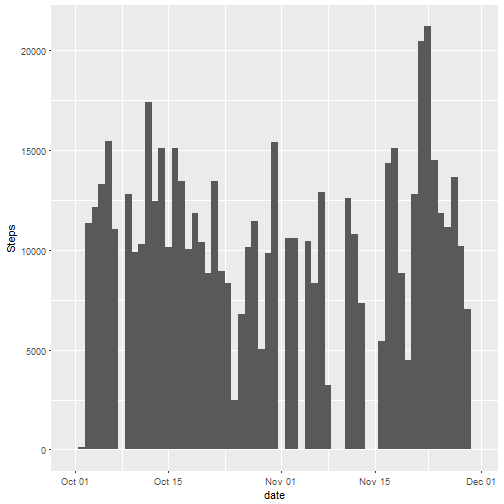

```r
---
title: "Reproducible Research: Peer Assessment 1"
author: "Xiqian(Kevin) Chen"
date: "December 10, 2017"
output: 
  html_document: 
    Keep_md: true
---
```

```
## Error: <text>:10:0: unexpected end of input
## 8: ---
## 9: 
##   ^
```


### Introduction
It is now possible to collect a large amount of data about personal movement using activity monitoring devices such as a Fitbit, Nike Fuelband, or Jawbone Up. These type of devices are part of the "quantified self" movement - a group of enthusiasts who take measurements about themselves regularly to improve their health, to find patterns in their behavior, or because they are tech geeks. But these data remain under-utilized both because the raw data are hard to obtain and there is a lack of statistical methods and software for processing and interpreting the data.

This assignment makes use of data from a personal activity monitoring device. This device collects data at 5 minute intervals through out the day. The data consists of two months of data from an anonymous individual collected during the months of October and November, 2012 and include the number of steps taken in 5 minute intervals each day.

The data for this assignment can be downloaded from the course web site:
https://d396qusza40orc.cloudfront.net/repdata%2Fdata%2Factivity.zip

The variables included in this dataset are:

steps: Number of steps taking in a 5-minute interval (missing values are coded as NA)
date: The date on which the measurement was taken in YYYY-MM-DD format
interval: Identifier for the 5-minute interval in which measurement was taken
The dataset is stored in a comma-separated-value (CSV) file and there are a total of 17,568 observations in this dataset.

### R Packages
In order to help us analyse the data, we are going to use folloiwng pakcages

```r
library("tidyr")
library("plyr")
library("dplyr")
library("chron")
library("hms")
library("scales")
library("ggplot2")
```

### Functions
The following functions are used to substring left or right character of a string. They both have two parameters(text, num_char). 

text: input parameter for the text
num_char: how many characters we want to substring from the function


```r
right = function(text, num_char) {
  substr(text, nchar(text) - (num_char-1), nchar(text))
}

left = function(text, num_char) {
  substr(text, 1, num_char)
}
```

### Data Loading & Tidy
Make sure that the csv file "activity.csv" is located in your working directory

```r
activity <- read.csv("activity.csv")
```

Then convert the variable "date" into date format

```r
activity$date <- as.Date(as.character(activity$date), "%m/%d/%Y")
```

### Data Exploratory

#### Q1. What is mean total number of steps taken per day?
For this part of the assignment, you can ignore the missing values in the dataset.


*1.Calculate the total number of steps taken per day*

Use "Group_by" and "summaris_at" function to get the summary information per day

```r
activity <- group_by(activity, date) 
activity_t_s <- activity %>% summarise_at("steps", funs(sum))
activity_t_s[is.na(activity_t_s$steps) == TRUE, ]$steps <- 0
```


*2.Make a histogram of the total number of steps taken each day*

Use ggplot2 to plot the histogram function, the "weight=" option in the aes() can make steps as the y-axis

```r
ggplot(data = activity_t_s, aes(date, weight = steps))+
  geom_histogram(binwidth = 1)+
  labs(y="Steps")
```




*3.Calculate and report the mean and median of the total number of steps taken per day*

Mean of the total Number of steps taken per day

```r
summary(activity_t_s$steps)["Mean"]
```

```
##    Mean 
## 9354.23
```

Median of the total Number of steps taken per day

```r
summary(activity_t_s$steps)["Median"]
```

```
## Median 
##  10395
```

#### Q2. What is the average daily activity pattern?


*1.Make a time series plot (i.e. type = "l") of the 5-minute interval (x-axis) and the average number of steps taken, averaged across all days (y-axis)*

First, we will need to extract the data withouth NA records. Also convert the mean of steps into integer

```r
activity2 <- group_by(activity, interval)
activity_t_s2 <- activity2[is.na(activity2$steps) == FALSE,] %>% summarise_at("steps", funs(mean))
activity_t_s2$steps <- as.integer(activity_t_s2$steps)
```

In order make the plot looks better, I decide to convert the "interval" into POSIXct format

```r
time_1<- paste("000", activity_t_s2$interval, sep="")
time_2<- sapply(time_1, right, num_char = 4, USE.NAMES = FALSE)
time_3<- paste(sapply(time_2, left, num_char= 2), sapply(time_2, right, num_char = 2), sep = ":")
time_4<- as.POSIXct(time_3, format="%H:%M", tz="America/New_York")
activity_t_s2$time_stamp <- time_4
activity_t_s2 <- activity_t_s2[order(activity_t_s2$time_stamp),]
```

Now the time seires plot is as following

```r
ggplot(activity_t_s2, aes(time_stamp, steps))+
  geom_line()+
  scale_x_datetime( breaks = date_breaks("1 hour"), minor_breaks = date_breaks("30 hour"), labels = date_format("%H:%M", tz="America/New_York"))+
  labs(x = "Time - hour:Minute")
```


*2.Which 5-minute interval, on average across all the days in the dataset, contains the maximum number of steps?*

From the data, we see that the 8:35 contains the maximum number of stpes.

```r
activity_t_s2[activity_t_s2$steps==max(activity_t_s2$steps),]$interval
```

```
## [1] 835
```

#### Q3. Imputing missing values
Note that there are a number of days/intervals where there are missing values (coded as NA). The presence of missing days may introduce bias into some calculations or summaries of the data.


*1.Calculate and report the total number of missing values in the dataset (i.e. the total number of rows with NAs)*

```r
count(activity[is.na(activity$steps) == TRUE,])
```

```
## # A tibble: 8 x 2
## # Groups:   date [8]
##         date     n
##       <date> <int>
## 1 2012-10-01   288
## 2 2012-10-08   288
## 3 2012-11-01   288
## 4 2012-11-04   288
## 5 2012-11-09   288
## 6 2012-11-10   288
## 7 2012-11-14   288
## 8 2012-11-30   288
```


*2.Devise a strategy for filling in all of the missing values in the dataset. The strategy does not need to be sophisticated. For example, you could use the mean/median for that day, or the mean for that 5-minute interval, etc.*

From my thinking, the mean for that 5-minute interval makes more sense to impute the missing value because peopel tend to walk the similar steps at the same time period. 

```r
activity2 <- group_by(activity, interval)
activity_t_s2 <- group_by(activity_t_s2, interval)

activity_j <- merge(activity2, activity_t_s2, by="interval", all.x=TRUE)
activity_j[is.na(activity_j$steps.x) == TRUE, ]$steps.x <- activity_j[is.na(activity_j$steps.x) == TRUE, ]$steps.y
```


*3.Create a new dataset that is equal to the original dataset but with the missing data filled in.*

```r
activity_im <- activity_j[, 1:3]
colnames(activity_im)<- c("interval", "steps", "date")
```


*4.Make a histogram of the total number of steps taken each day and Calculate and report the mean and median total number of steps taken per day. Do these values differ from the estimates from the first part of the assignment? What is the impact of imputing missing data on the estimates of the total daily number of steps?*

The plot is as following. The process is similar as previous hisgotram plot

```r
activity_im <- group_by(activity_im, date)
activity_im_t_s <- activity_im %>% summarise_at("steps", funs(sum))

ggplot(data = activity_im_t_s, aes(date, weight = steps))+
  geom_histogram(binwidth = 1)
```


Both mean and median values increased after imputing the missing values. 

```r
summary(activity_im_t_s$steps)["Mean"]
```

```
##     Mean 
## 10749.77
```

```r
summary(activity_im_t_s$steps)["Median"]
```

```
## Median 
##  10641
```

#### Q4. Are there differences in activity patterns between weekdays and weekends?
For this part the weekdays() function may be of some help here. Use the dataset with the filled-in missing values for this part.


*1.Create a new factor variable in the dataset with two levels - "weekday" and "weekend" indicating whether a given date is a weekday or weekend day.*

The new factor variable "Weekend" is created as following

```r
activity_im$WeekName <- weekdays(activity_im$date, abbreviate = FALSE)
activity_im$Weekend <- 0
activity_im[activity_im$WeekName %in% c("Saturday", "Sunday"), ]$Weekend <- 1
activity_im$Weekend <- as.factor(activity_im$Weekend)
```


*2.Make a panel plot containing a time series plot (i.e. type = "l") of the 5-minute interval (x-axis) and the average number of steps taken, averaged  across all weekday days or weekend days (y-axis). See the README file in the GitHub repository to see an example of what this plot should look like using simulated data.*

Ploting Data Preparation

```r
activity_im2 <- group_by(activity_im, interval, Weekend)
activity_im2_t_s <- activity_im2 %>% summarise_at("steps", funs(mean))
activity_im2_t_s$steps <- as.integer(activity_im2_t_s$steps)
levels(activity_im2_t_s$Weekend) <- c("Weekday", "Weekend")

time_i_1<- paste("000", activity_im2_t_s$interval, sep="")
time_i_2<- sapply(time_i_1, right, num_char = 4, USE.NAMES = FALSE)
time_i_3<- paste(sapply(time_i_2, left, num_char= 2), sapply(time_i_2, right, num_char = 2), sep = ":")
time_i_4<- as.POSIXct(time_i_3, format="%H:%M", tz="America/New_York")
activity_im2_t_s$time_stamp <- time_i_4
activity_im2_t_s <- activity_im2_t_s[order(activity_im2_t_s$time_stamp),]
```

The comparison 5-minute interval time series plots are as following

```r
ggplot(activity_im2_t_s, aes(time_stamp, steps))+
  geom_line()+
  scale_x_datetime( breaks = date_breaks("1 hour"), minor_breaks = date_breaks("30 hour"), labels = date_format("%H:%M", tz="America/New_York"))+
  facet_grid(Weekend~.)
```


```
```

